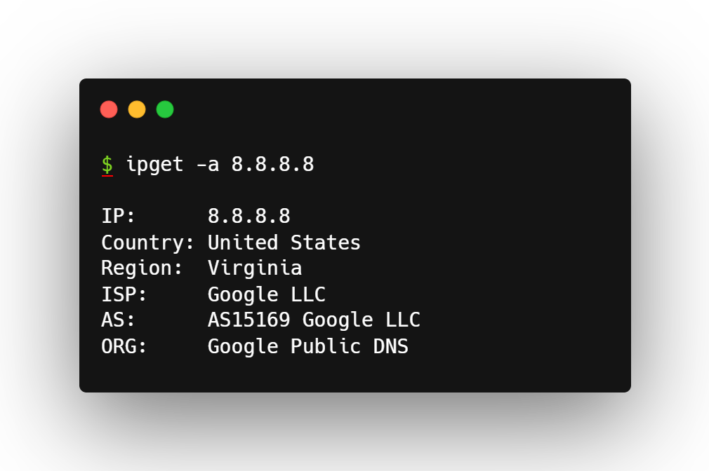

# ipget

Fetch information on IP addresses. 

## Requirements
- Golang 1.19.2 or above recommended. 

## Install
- Clone the repository.
- CD into the cloned directory.
- Run `go install .`

## Preview

## License
This project is licensed under the MIT license.